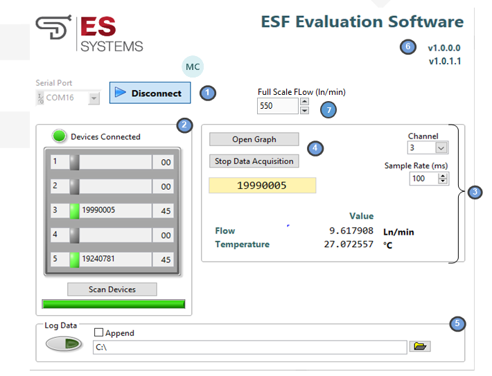
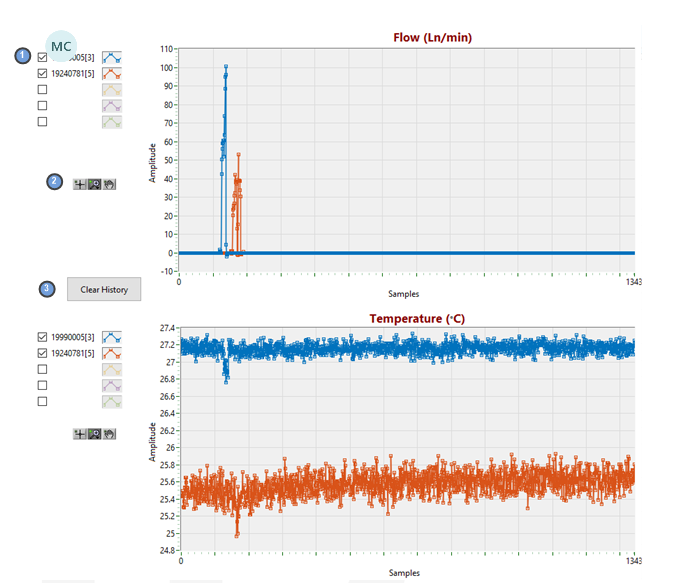
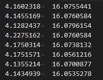

| ESRF-ESF Evaluation Software Manual |                                     |
|-------------------------------------|-------------------------------------|
| Title                               | ESRF-ESF Evaluation Software Manual |
| Doc Ref                             | ESS-239/131119/EXC-REV.02           |

**  
**

**DOCUMENT TRACKING TABLE**

|             |            |                                                         |                  |
|-------------|------------|---------------------------------------------------------|------------------|
| **Version** | **Date**   | **Reason for change**                                   |                  |
| 1           | 13/11/2019 | Initial version                                         | L. Voudouris     |
| 2           | 22/01/2021 | Added support for different flow versions of the device | L. Voudouris     |
| 3           | 20/9/2022  | Updated instructions for installer                      | C. Papazachariou |

**  
**

# Programming GUI

## Software Installation

To install the ESRF-ESF Evaluation Software:

- Navigate to the “Volume” folder.

- Run ESRF-ESF_Evaluation_Software_Setup.exe (as administrator if
  possible) and follow the installation wizard.

- Once the installation is complete run ESRF-ESF_Evaluation_Software.exe

## Application Description

| **\#** | **Description**             |
|--------|-----------------------------|
| 1      | Connection row              |
| 2      | Device scan                 |
| 3      | Data display                |
| 4      | Open data graph window      |
| 5      | Log file configuration      |
| 6      | Evaluation Software version |
| 7      | Full Scale Flow             |

<u>1. Connection Row</u>

Use the *Serial Port* dropdown box to select the COM port that
corresponds to the Evaluation Kit and press the *Connect* button, which
upon successful connection will change color and its text will now
display *Disconnect*. Pressing *Disconnect* will stop communication with
the Evaluation Kit. After connection with the kit is established the
software will automatically scan for connected devices (see Device Scan
below).

<u>2. Device Scan</u>

The software scans for connected devices and displays the results in a
table. The table columns indicate the channel number, an LED that goes
green when a device is connected to the channel, the device’s serial
number and the device’s I2C slave address (in hex). Device scan is
performed automatically after successfully establishing a connection
with the Evaluation Kit or can be manually started by pressing the *Scan
Devices* button. The scan progress is indicated by a progress bar below
the button. If a device is found on any channel the *Devices Connected*
LED lights green.

<u>3. Data display</u>

The received data values are displayed in this table, Flow (in ln/min)
and Temperature (in oC). The user can choose which device’s
data is displayed by selecting the appropriate channel. The user can
also choose the sample rate of the data. The minimum sample rate is
100ms. The same sample rate applies to the graphs and the *Log File*.
The user can pause data acquisition at any time by pressing the *Stop
Data Acquisition* button.

<u>4. Open data graph window</u>

Pressing the button will open the *Graph Window*

There’s a separate graph for each quantity. By default, data for all
connected sensors is displayed but the user can select/deselect any of
them (1). The user can also zoom/pan the graph area using the respective
buttons (2) and clear the graph area by pressing the *Clear History*
button (3).

<u>5. Log File Configuration</u>

Optionally the user can log the received data to a file. Use the
*Browse* button (folder icon) to select a directory for the log files
and press the button to start logging. A log file for each sensor is
created with the sensor’s serial number as the filename. Pressing the
button again will stop logging. By default, existing files are
overwritten unless the *Append* option is checked. Data is logged to the
file at the rate specified in the Sample Rate textbox as tab delimited
values. Measured quantities are written in the following order

| **Flow** | **Temperature** |
|----------|-----------------|

For each measured quantity we log its floating-point value with 6 digits
of precision. An example is shown below:

<u>6. Evaluation Software Version</u>

Displays the current version of the application

<u>7. Full Scale Flow</u>

For the software to correctly interpret the readout data from each
device correctly the user must enter the fill scale value of the device
multiplied by 1.1. This is because the devices’ output clips at values
10% above the true full scale value.

For example for a 200lpm device the value to be entered in the software
is 220 ln/min
